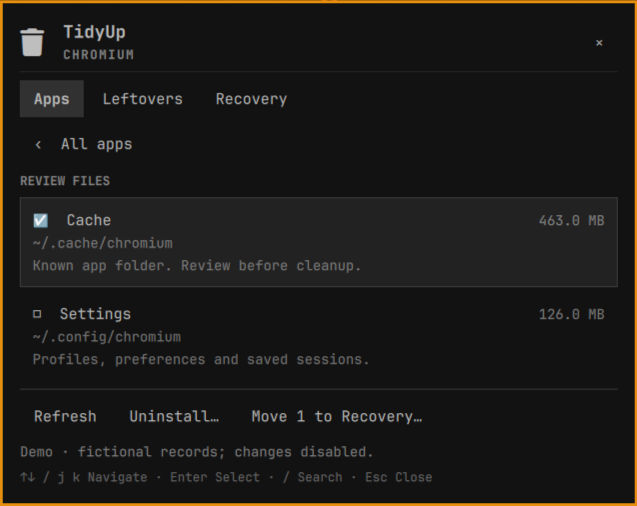

# Omarchy TidyUp

<p>
  <a href="https://github.com/tcballard/omarchy-plugin-tidyup/actions/workflows/test.yml"></a>
  <a href="LICENSE"></a>
  <a href="https://github.com/tcballard/omarchy-badges"></a>
</p>

Review an app's files before removing them. TidyUp brings app cleanup to the
Omarchy desktop with **Apps**, **Leftovers**, and **Recovery** in a native popout.
Click the waste-paper-bin icon in the bar, or summon it from the keyboard.



- Browse installed Arch/AUR desktop apps and search by name or package.
- Review exact app-folder matches in XDG settings, cache, data, and state directories.
- See estimated sizes and the reason each folder matched; nothing is preselected.
- Move selected folders to Recovery, restore them, or explicitly delete them permanently.
- Open a native package uninstall in a terminal, with pacman's own confirmation.
- Inspect known leftover folders whose related native packages are no longer installed.

TidyUp is an independent Linux project inspired by Pearcleaner's review-before-removal
workflow. It does not reuse Pearcleaner code or implement its macOS-specific features.

## Compatibility

Targets Omarchy 4 Quattro with its native `KeyboardPanel`, `PanelHero`, and
`PanelKeyCatcher` components. The verified development host was Omarchy
`dev (4ee6d4ee)` on 2026-09-14; this is not a claim that every 4.x release was tested.

Requires Python 3.11+, pacman, sudo, and Omarchy's
terminal launcher. These are normally supplied by Omarchy. Linux `renameat2` is
used for atomic recovery moves that never overwrite a destination. No downloads,
network services, install hooks, elevated Python, or background polling are used.

## Local development installation

From this checkout, link the plugin (the destination must not already exist):

```bash
ln -s "$PWD" ~/.config/omarchy/plugins/io.github.tcballard.tidyup
omarchy-shell shell rescanPlugins
omarchy plugin enable io.github.tcballard.tidyup
omarchy-shell shell summon io.github.tcballard.tidyup
```

Git repository: [tcballard/omarchy-plugin-tidyup](https://github.com/tcballard/omarchy-plugin-tidyup).
Install with:

```bash
omarchy plugin add https://github.com/tcballard/omarchy-plugin-tidyup.git --enable
```

Marketplace submission is separate from this build.

## Workflow

1. Choose an app and review its matching folders. Close the app before moving files.
2. Select specific items and use **Move to Recovery**. Settings/data removal can reset
   profiles, saved sessions, preferences, or app-managed content.
3. To uninstall the native package, choose **Uninstall package** and review the
   transaction in the terminal. This uses `sudo pacman -R -- <package>`; it does not
   automatically remove dependencies or bypass confirmation. Refresh Apps afterward.
4. Open **Recovery** to restore an item. If an app recreated the original folder,
   restoration stops without overwriting it. Resolve that conflict yourself first.
5. **Delete…** in Recovery permanently removes just that item after a separate
   confirmation. Recovery alone does not reclaim disk space. Filesystem snapshots
   and files held open by a running app can retain storage even after deletion.

Uninstallation and personal-file cleanup are separate operations. Clean personal
files while the app is still listed, or inspect known Leftovers after uninstallation.

## Keyboard navigation

| Key | Action |
| --- | --- |
| Up/Down or j/k | Move the visible cursor through controls and rows |
| Left/Right or h/l | Change tabs, recovery action, or confirmation choice |
| Enter/Space | Activate the highlighted control or select a file |
| `/` or Ctrl+F | Focus app search |
| 1/2/3 (also Ctrl+1/2/3) | Apps / Leftovers / Recovery |
| Escape | Leave search, cancel a confirmation, or close the panel |
| Backspace | Return from file review to Apps |
| x or Delete | Request deletion of the highlighted Recovery item |
| r | Refresh |
| Tab/Shift+Tab | Switch neighboring bar panels, matching Omarchy popouts |

Inside search, Down/Enter moves into the results; Tab and Shift+Tab leave the
editor. Confirmations start on **Cancel**. Every action is also available with
the pointer. Omarchy's existing bar-panel shortcuts can open this widget; the
canonical command is `omarchy-shell shell summon io.github.tcballard.tidyup`.

## Matching and limits

The first version supports native package-owned desktop entries in
`/usr/share/applications`. It does not manage Flatpak, AppImage, webapps, manually
installed apps, development environments, system services, or package caches.

Candidates come from exact package names, desktop IDs, matching `.conf` / `rc`
filenames, and a small explicit association table in `backend/tidyup.py`. There is
no recursive fuzzy search across your home directory. Shared desktop directories
and Omarchy configuration are excluded. Symlinked XDG roots, symlink candidates,
special files, and differently owned candidate roots are skipped. Size estimates
are bounded; `≥` indicates a partial estimate and sizes are logical bytes, not
promised disk savings. Matching a name does not establish exclusive ownership.

Leftovers is a review aid for the documented association table, not proof that a
folder is unused: alternate installation methods may still use it. Your document
folders and Obsidian vaults are not searched, but app-managed data inside a selected
folder moves with that folder. Close all editions of an app before cleaning.

## Recovery and removal

Recovery lives in `$XDG_DATA_HOME/omarchy-tidyup/recovery` (normally
`~/.local/share/omarchy-tidyup/recovery`) with mode 0700. Each move writes a JSON
receipt before renaming the file into `<token>.data`; receipts remain as a small
local audit history after restore/deletion. Moves across filesystems are refused.
TidyUp checks selection metadata again before moving and holds directory descriptors
without following symlink components. Concurrent cleanup/restore/delete operations
are serialized. This does not isolate the plugin from other programs running as you.

Disable with `omarchy plugin disable io.github.tcballard.tidyup`. For a local symlink
installation, unlink only that link after disabling. For a git-installed plugin,
use `omarchy plugin remove io.github.tcballard.tidyup`. Recovery files intentionally
survive plugin removal. Restore or review them before uninstalling TidyUp; never
blindly delete the recovery directory if you still need its contents.

## Development

```bash
./tests/run
python3 -I backend/tidyup.py catalogue
./demo/run --shell-path "$OMARCHY_PATH"
```

The reversible demo imports committed fictional records and blocks backend mutations.
It verifies keyboard interactions, captures the native panel, and restores shell
configuration, workspace and pointer. It requires a single unrotated monitor.
Do not interact with the desktop during the brief automated input sequence.
Tests operate in temporary home directories with fake package inventories; they never
remove installed packages or personal files. See [design](docs/DESIGN.md) and
[verification](docs/VERIFICATION.md) for scope and evidence.

MIT licensed. Built with [Build Omarchy Plugins](https://github.com/tcballard/build-omarchy-plugins).
